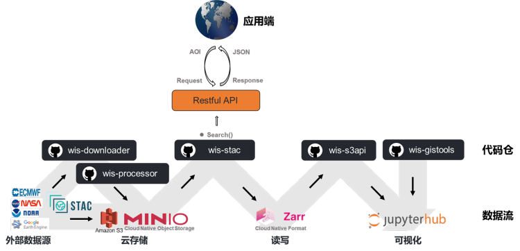
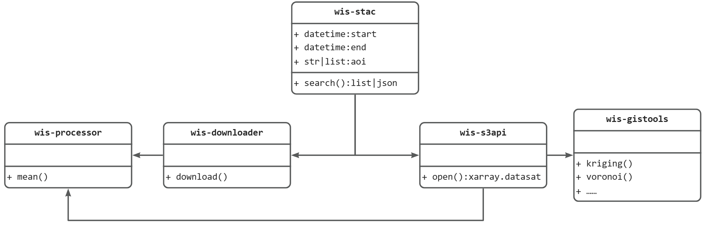

<!--
 * @Author: Jianfeng Zhu
 * @Date: 2023-10-13 19:48:15
 * @LastEditTime: 2023-10-13 21:27:31
 * @LastEditors: Wenyu Ouyang
 * @Description: English version
 * @FilePath: /hydro_opendata/README.md
 * Copyright (c) 2023-2024 Jianfeng Zhu. All rights reserved.
-->
# hydro-opendata

📜 [中文文档](README.zh.md)

**Methods and paths for obtaining, managing, and utilizing open data for hydrological scientific computations.**

- Free software: MIT license
- Documentation: <https://hydro-opendata.readthedocs.io/en/latest/>
- 
## Background

In the era of artificial intelligence, data-driven hydrological models have been extensively researched and applied. With the advancements in remote sensing technologies and the trend towards open data sharing, accessing data has become more straightforward with a plethora of options. For researchers, questions like what data is required, what data can be accessed, where to download it, how to read it, and how to process it, are crucial. This repository aims to address these concerns.

This repository primarily focuses on external open data, categorizing data types, and creating a list. It aims to build a data flow and its tech stack that can seamlessly "download-store-process-read-write-visualize" the data.

## Overall Solution

## Main Data Sources

From our current understanding, the external data suitable for hydrological modeling includes but is not limited to:

| **Primary Category** | **Secondary Category** | **Update Frequency** | **Data Structure** | **Example** |
| --- | --- | --- | --- | --- |
| Basic Geography | Hydrological Elements | Static | Vector | Watershed boundary, site |
|  | Terrain | Static | Raster | [DEM](https://github.com/DahnJ/Awesome-DEM), flow direction, land use |
| Weather & Meteorology | Reanalysis | Dynamic | Raster | ERA5 |
|  | Near Real-Time | Dynamic | Raster | GPM |
|  | Forecast | Rolling | Raster | GFS |
| Imagery | Satellite Remote Sensing | Dynamic | Raster | Landsat, Sentinel, MODIS |
|  | Street View Images | Static | Multimedia |  |
|  | Surveillance Videos | Dynamic | Multimedia |  |
|  | Drone Footage | Dynamic | Multimedia |  |
| Crowdsourced Data | POI | Static | Vector | Baidu Map |
|  | Social Networks | Dynamic | Multimedia | Weibo |
| Hydrological Data | River Flow Data | Dynamic | Tabular | GRDC |

Data can be categorized based on their update frequency into static and dynamic data.

From a structural perspective, data can be classified into vector, raster, and multimedia (unstructured data).

## Structure and Functional Framework

### wis-stac

Data inventory and its metadata. Returns a data list based on AOI.

### wis-downloader

Downloads data from external sources. Depending on the data source, the download methods may vary, including:

- Integration with official APIs, e.g., [bmi_era5](https://github.com/gantian127/bmi_era5)
- Retrieving data download links, e.g., [Herbie](https://github.com/blaylockbk/Herbie), [MultiEarth](https://github.com/bair-climate-initiative/multiearth), [Satpy](https://github.com/pytroll/satpy). Most cloud data platforms like Microsoft, AWS, etc., organize data mostly as [stac](https://github.com/radiantearth/stac-spec).

### wis-processor

Preprocesses the data, such as watershed averaging, feature extraction, etc.

Uses [kerchunk](https://fsspec.github.io/kerchunk/) to convert different format data to [zarr](https://zarr.readthedocs.io/en/stable/) format and stores it in [MinIO](http://minio.waterism.com:9090/) server. This enables cross-file reading and enhances data reading efficiency.

### wis-s3api

After data processing in MinIO, it supports cross-file reading. Just provide data type, time range, and spatial range parameters to fetch the data.

For remote sensing imagery, due to the vast amount of data, it's not feasible to download and read each file. One can use [stac+stackstac](./data_api/examples/RSImages.ipynb) to directly read Sentinel or Landsat data into an xarray dataset.

### wis-gistools

Integrates commonly used GIS tools, such as Kriging interpolation, Thiessen polygons, etc.

- Kriging interpolation: [PyKrige](https://github.com/GeoStat-Framework/PyKrige)
- Thiessen polygon: [WhiteboxTools.VoronoiDiagram](https://whiteboxgeo.com/manual/wbt_book/available_tools/gis_analysis.html?highlight=voro#voronoidiagram), [scipy.spatial.Voronoi](https://docs.scipy.org/doc/scipy/reference/generated/scipy.spatial.Voronoi.html)
- Watershed delineation: [Rapid Watershed Delineation using an Automatic Outlet Relocation Algorithm](https://github.com/xiejx5/watershed_delineation), [High-performance watershed delineation algorithm for GPU using CUDA and OpenMP](https://github.com/bkotyra/watershed_delineation_gpu)
- Watershed averaging: [plotting and creation of masks of spatial regions](https://github.com/regionmask/regionmask)

## Visualization

Use [leafmap](https://github.com/giswqs/leafmap) to display geospatial data within the Jupyter platform.

## Others

- [hydro-GIS resource directory](./resources/README.md)
