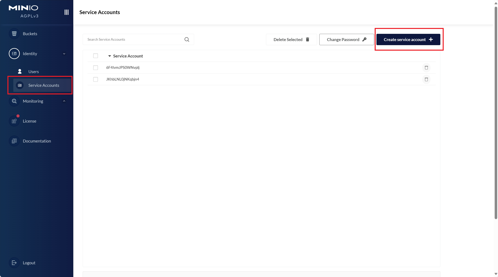

# 安装与配置

## 安装

在命令行运行：

```shell
pip install hydro_opendata
```

## 配置

首次使用hydro_opendata时，如：

```python
from hydro_opendata.data.minio import GPM
```

会提示输入`access_key`和`secret_key`。由于目前hydro_opendata部分功能仅限于团队内部使用，所以使用前需要向管理员申请[minio](http://minio.waterism.com:9090/)账号。

1. 进入[minio网页客户端](http://minio.waterism.com:9090/)
2. 点击左侧导航栏`Identity`进入`Service Accounts`
3. 在右侧主界面点击`Create Service Accounts`

